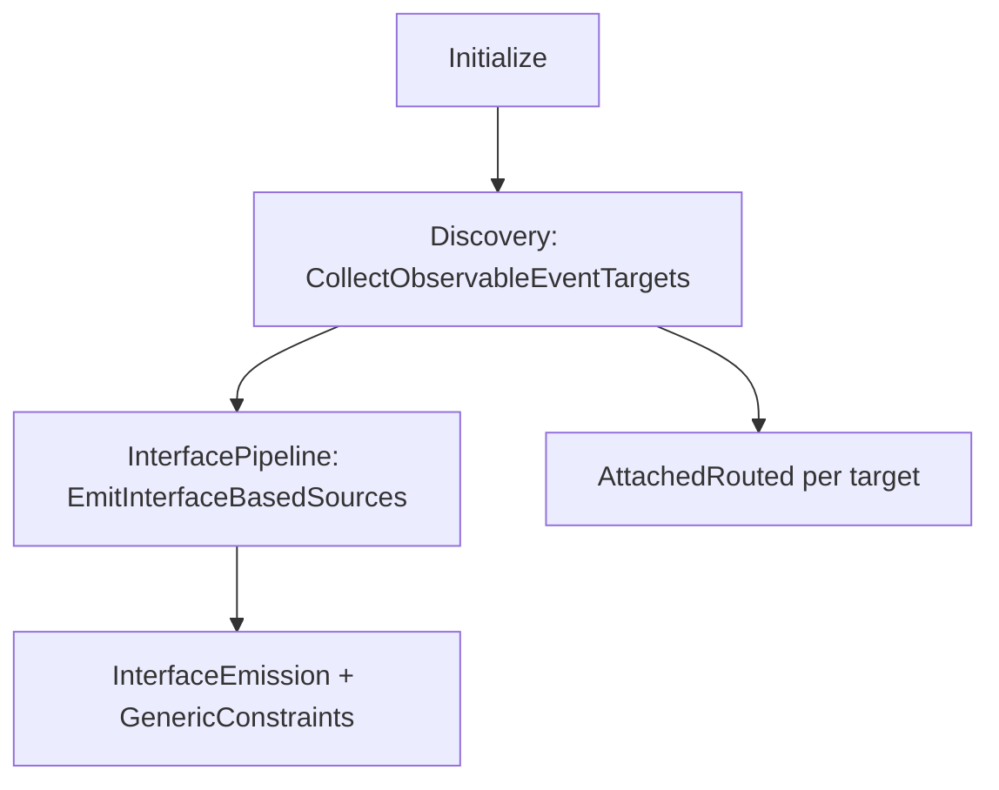

# ObservableEventsGenerator (contributors)

::: tip Languages
[简体中文](../zh/architecture/observable-events-generator)
:::

This page describes **generator repository layout** for `ObservableEventsGenerator`. It does **not** change the consumer API documented in [Observable events](../generators/observable-events.md).

::: info No consumer impact
The generator was refactored into `partial` files and unused pre–0.6.0 **flat wrapper** codegen was removed. **Generated output and public extension methods are unchanged** from 0.6.1.
:::

## Where the code lives

Shared sources: `MvvmAIO.R3.SourceGenerators/MvvmAIO.R3.SourceGenerators/` (listed in `MvvmAIO.R3.SourceGenerators.projitems`; all `Roslyn*` projects import it).

`ObservableEventsGenerator` is a **`public sealed partial class`** with `[Generator]` on the root file only.

## File map

| File | Role |
|------|------|
| `ObservableEventsGenerator.cs` | `Initialize`, post-init bootstrap, `RegisterSourceOutput` orchestration |
| `ObservableEvents/ObservableEventsConstants.cs` | Entry method names, `GeneratedNamespace`, `QualifiedType()` |
| `ObservableEvents/ObservableEventsEntryKind.cs` | `FromEvents`, routed, attached kinds |
| `ObservableEvents/ObservableEventsModels.cs` | `ObservableEventTargetSets`, `EventInterfaceDescriptor`, constraint targets |
| `ObservableEventsGenerator.Discovery.cs` | Syntax filtering, `CollectObservableEventTargets` |
| `ObservableEventsGenerator.InterfacePipeline.cs` | `EmitInterfaceBasedSources`, hierarchy, name collisions |
| `ObservableEventsGenerator.InterfaceEmission.cs` | Interface / `*Impl` / extension emission |
| `ObservableEventsGenerator.GenericConstraints.cs` | `where T : A, B` combined interfaces |
| `ObservableEventsGenerator.RoutedDetection.cs` | WPF / Avalonia routed CLR detection |
| `ObservableEventsGenerator.AttachedRouted.cs` | Avalonia attached routed extensions |
| `ObservableEventsGenerator.EventProperties.cs` | Event `Observable` properties, delegate checks |
| `ObservableEventsGenerator.Helpers.cs` | Identifiers, constraint clauses, diagnostics helpers |
| `ObservableEventsSyntaxFactory.cs` | Roslyn syntax only (no orchestration) |

When you add a `.cs` file, register it in **alphabetical order** in `MvvmAIO.R3.SourceGenerators.projitems`.

## Runtime pipeline

1. **Post-init** — bootstrap extensions + `NullEvents` (`GeneratorBootstrapSyntaxFactory`).
2. **Discovery** — record types from `FromEvents()`, routed entries, generic constraints, attached routed.
3. **Interface pipeline** — build `EventInterfaceDescriptor` tree → `EventInterfaces.{kind}.g.cs` + `{Type}.{kind}.g.cs`.
4. **Attached routed** — separate path; returns `Observable<T>` (not the interface model).

Static `ObservableEventsStatics` / `OBS_*` discovery exists but generation is **disabled** (`StaticObservableEventsGenerationEnabled = false`).

## Removed internal paths

Do **not** reintroduce without a design discussion:

- v0.4.x flat **wrapper classes** (`GenerateObservableSourceForType`, `CreateWrapperClass`, old `CreateExtensionsClass` chain).

The only instance and routed paths are the **interface pipeline** above.

## Further reading (generator repo)

| Document | Contents |
|----------|----------|
| [AGENTS.md](https://github.com/MvvmAIO/MvvmAIO.R3.SourceGenerators/blob/master/AGENTS.md) | Conventions, CI, diagnostics, full source map |
| [docs/README.md](https://github.com/MvvmAIO/MvvmAIO.R3.SourceGenerators/blob/master/docs/README.md) | In-repo developer doc index |
| [design-interface-based-event-generation.md](https://github.com/MvvmAIO/MvvmAIO.R3.SourceGenerators/blob/master/docs/design-interface-based-event-generation.md) | Interface hierarchy algorithm (中文), §11 source layout |

## Related pages

- [Architecture overview](./overview.md)
- [Observable events](../generators/observable-events.md) — consumer guide
- [Contributing](../contributing.md)
