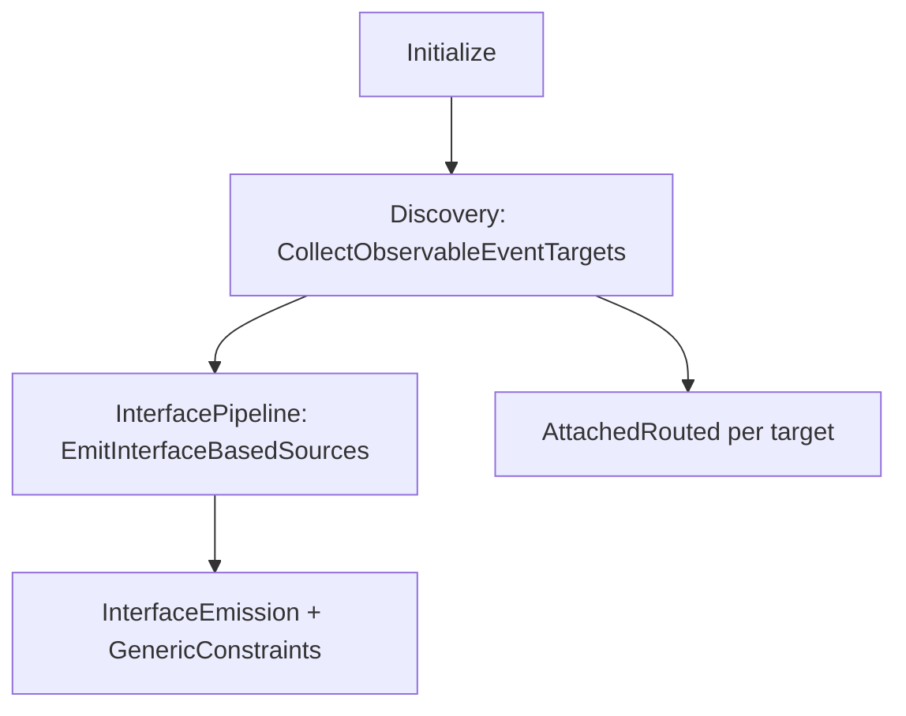

# ObservableEventsGenerator（贡献者）

::: tip 语言
[English](../../architecture/observable-events-generator)
:::

本文说明 **`ObservableEventsGenerator` 在生成器仓库中的源码布局**，不改变 [Observable 事件](../generators/observable-events.md) 中的使用者 API。

::: info 对使用者无影响
生成器已拆分为 `partial` 文件，并移除了 0.6.0 接口化之前遗留的**扁平 wrapper** 发码路径。**生成物与公开扩展方法与 0.6.1 一致**。
:::

## 代码位置

共享源码目录：`MvvmAIO.R3.SourceGenerators/MvvmAIO.R3.SourceGenerators/`（由 `MvvmAIO.R3.SourceGenerators.projitems` 列出；各 `Roslyn*` 项目引用）。

`ObservableEventsGenerator` 为 **`public sealed partial class`**，仅根文件带 `[Generator]`。

## 文件一览

| 文件 | 职责 |
|------|------|
| `ObservableEventsGenerator.cs` | `Initialize`、post-init、`RegisterSourceOutput` 编排 |
| `ObservableEvents/ObservableEventsConstants.cs` | 入口方法名、`GeneratedNamespace`、`QualifiedType()` |
| `ObservableEvents/ObservableEventsEntryKind.cs` | `FromEvents`、路由、附加路由等种类 |
| `ObservableEvents/ObservableEventsModels.cs` | `ObservableEventTargetSets`、`EventInterfaceDescriptor`、约束目标 |
| `ObservableEventsGenerator.Discovery.cs` | 语法过滤、`CollectObservableEventTargets` |
| `ObservableEventsGenerator.InterfacePipeline.cs` | `EmitInterfaceBasedSources`、层次与命名冲突 |
| `ObservableEventsGenerator.InterfaceEmission.cs` | 接口 / `*Impl` / 扩展方法发射 |
| `ObservableEventsGenerator.GenericConstraints.cs` | `where T : A, B` 组合接口 |
| `ObservableEventsGenerator.RoutedDetection.cs` | WPF / Avalonia 路由 CLR 判定 |
| `ObservableEventsGenerator.AttachedRouted.cs` | Avalonia 附加路由扩展 |
| `ObservableEventsGenerator.EventProperties.cs` | 事件 Observable 属性、委托检查 |
| `ObservableEventsGenerator.Helpers.cs` | 标识符、约束子句、诊断辅助 |
| `ObservableEventsSyntaxFactory.cs` | 纯 SyntaxFactory（无编排） |

新增 `.cs` 时须在 `MvvmAIO.R3.SourceGenerators.projitems` 中按**字母序**添加 `Compile Include`。

## 运行时管线

1. **Post-init** — 引导扩展与 `NullEvents`（`GeneratorBootstrapSyntaxFactory`）。
2. **Discovery** — 从 `FromEvents()`、路由入口、泛型约束、附加路由等收集目标类型。
3. **接口管线** — 构建 `EventInterfaceDescriptor` → `EventInterfaces.{kind}.g.cs` + `{Type}.{kind}.g.cs`。
4. **附加路由** — 独立路径，返回 `Observable<T>`（非接口属性模型）。

静态 `ObservableEventsStatics` / `OBS_*` 的发现逻辑保留，但生成开关为 **false**。

## 已移除的内部路径

未经设计讨论请勿恢复：

- v0.4.x **扁平 wrapper**（`GenerateObservableSourceForType`、`CreateWrapperClass`、旧 `CreateExtensionsClass` 链等）。

实例事件与路由事件仅走上述**接口管线**。

## 延伸阅读（生成器仓库）

| 文档 | 内容 |
|------|------|
| [AGENTS.md](https://github.com/MvvmAIO/MvvmAIO.R3.SourceGenerators/blob/master/AGENTS.md) | 规范、CI、诊断、完整索引 |
| [docs/README.md](https://github.com/MvvmAIO/MvvmAIO.R3.SourceGenerators/blob/master/docs/README.md) | 仓库内开发文档索引 |
| [design-interface-based-event-generation.md](https://github.com/MvvmAIO/MvvmAIO.R3.SourceGenerators/blob/master/docs/design-interface-based-event-generation.md) | 接口层次算法与 §11 源码结构（中文） |

## 相关页面

- [架构总览](./overview.md)
- [Observable 事件](../generators/observable-events.md) — 使用者指南
- [贡献](../contributing.md)
